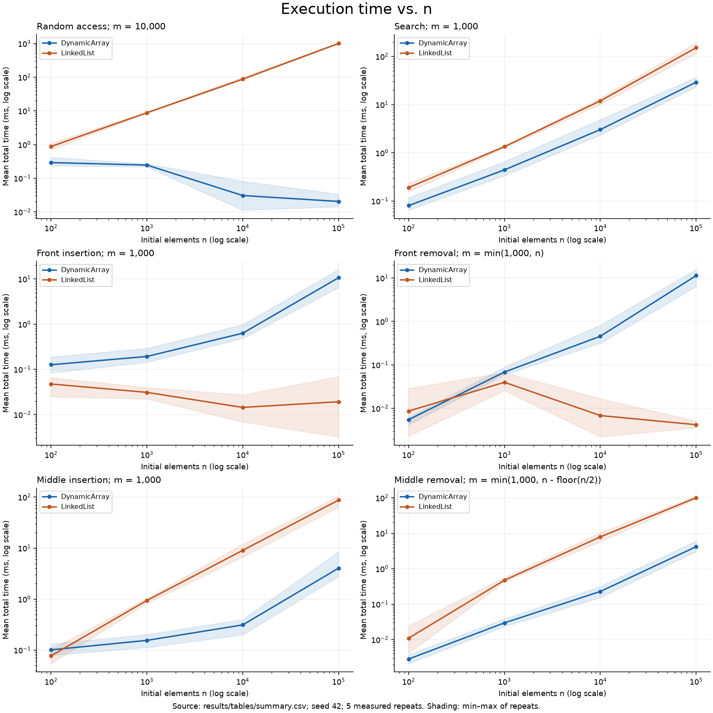
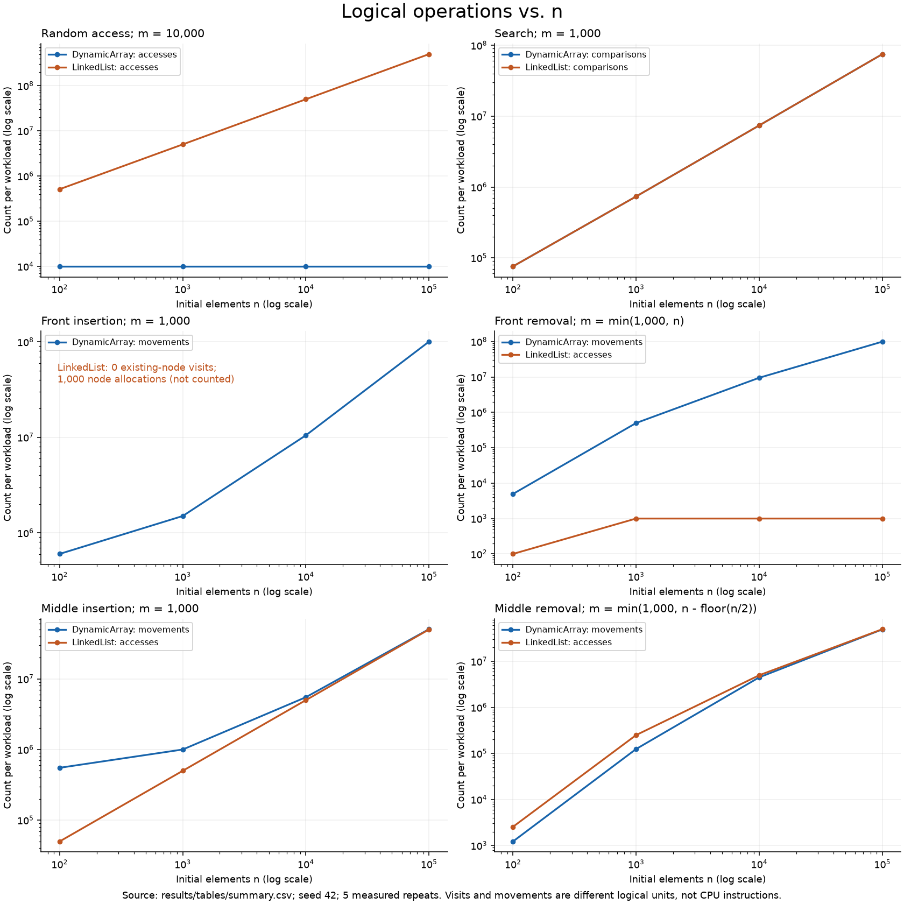
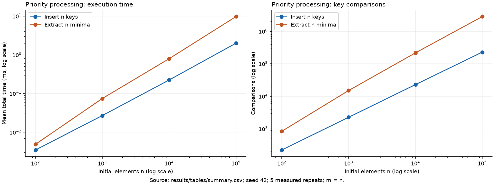

# Assignment 2 — Algorithmic Analysis, Correctness and Performance Trade-offs

## 1. Overview

This project implements a primitive-integer **Dynamic Array**, **singly Linked List**, and **binary Min-Heap** from scratch. It combines asymptotic analysis, two loop-invariant proofs, differential correctness tests, and reproducible measurements of four prescribed workloads. Java collections are used only as test or benchmark-output helpers, never as the storage of the required structures.

### Run the project

A JDK (Java 8 or newer) is required. Java source has no external dependencies.

```powershell
# Windows: locates JAVA_HOME, javac on PATH, or an installed JDK in ~/.jdks.
.\run.ps1
# Tests only:
.\run.ps1 -TestsOnly
# Explicit JDK, if necessary:
.\run.ps1 -JavaHome 'C:\path\to\jdk'
```

```sh
# Linux/macOS or a shell with a JDK on PATH:
mkdir -p build
javac -encoding UTF-8 -d build src/*.java
java -cp build Tests
java -Xms256m -Xmx1g -cp build Benchmark
```

To regenerate the plots and this report after benchmarking:

```sh
python -m venv .venv
# Windows:
.venv\Scripts\python -m pip install -r requirements.txt
.venv\Scripts\python scripts/render_results.py
# Linux/macOS: use .venv/bin/python instead.
```

`scripts/render_results.py` also validates every reported mean, standard deviation, repetition count, and the exact insertion/removal work formulas against raw results. Report prose is maintained in `report/README.template.md`; measured tables and cited values are filled automatically.

### Repository contents

```text
src/                 Implementations, Metrics, IntSequence, Tests, Benchmark
scripts/             CSV validation, plotting and report generation
report/              Reusable report template
results/tables/      raw.csv (280 measured runs), summary.csv (56 experiment means)
results/plots/       Three figures, each in PNG and SVG format
results/environment.txt
run.ps1              Compile, test and benchmark on Windows
requirements.txt     Plotting dependency; not needed to run Java
README.md            Individual report
```

## 2. Complexity Analysis

Here **n** is the current size for a single operation, **i** is a valid index, and **m** is the number of workload operations. Bounds concern valid operations on nonempty inputs as n grows; invalid-index and empty-heap errors take Θ(1). Θ(f(n)) means both an O(f(n)) upper bound and an Ω(f(n)) lower bound. A worst-case O(n) bound does not mean every call needs Ω(n).

The sequence average-case model uses uniformly selected valid indices; for search, successful targets have roughly uniform positions and a constant fraction of searches fail. Random heap insertion refers to independent random-order keys with a wide value range. Amortized bounds describe a sequence of calls and must not be confused with an average over input keys.

| Structure | Operation | Best time | Average / expected time | Worst single-call time | Auxiliary space per call |
|---|---|---|---|---|---|
| Dynamic Array | add(x) | Θ(1) | Θ(1) amortized* | Θ(n) | Θ(1); Θ(n) during growth |
| Dynamic Array | add(i, x) | Θ(1) | Θ(n) for uniform i | Θ(n) | Θ(1); Θ(n) during growth |
| Dynamic Array | remove(i) | Θ(1) | Θ(n) for uniform i | Θ(n) | Θ(1) |
| Dynamic Array | get(i) | Θ(1) | Θ(1) | Θ(1) | Θ(1) |
| Dynamic Array | contains(x) | Θ(1) | Θ(n) under stated model | Θ(n) | Θ(1) |
| Linked List | add(x) | Θ(1) | Θ(1) | Θ(1) | Θ(1) new node |
| Linked List | add(i, x) | Θ(1) | Θ(n) for uniform i | Θ(n) | Θ(1) new node |
| Linked List | remove(i) | Θ(1) | Θ(n) for uniform i | Θ(n) | Θ(1) |
| Linked List | get(i) | Θ(1) | Θ(n) for uniform i | Θ(n) | Θ(1) |
| Linked List | contains(x) | Θ(1) | Θ(n) under stated model | Θ(n) | Θ(1) |
| Min-Heap | insert(x) | Θ(1) | Expected amortized Θ(1) for random-order keys** | Θ(n) with growth; Θ(log n) without growth | Θ(1); Θ(n) during growth |
| Min-Heap | peekMin() | Θ(1) | Θ(1) | Θ(1) | Θ(1) |
| Min-Heap | extractMin() | Θ(1) | Θ(log n) for random, mostly distinct keys | Θ(log n) | Θ(1) |

\* At a fixed full capacity, every append must copy Θ(n) elements regardless of their values; otherwise it takes Θ(1). Over k appends from empty, capacities double, so the total copied elements form a geometric sum less than 2k. Thus the total cost is Θ(k), giving Θ(1) amortized per append. This is not a claim that a resizing call has constant expected time.

\** Sift-up has O(log n) worst-case comparisons and an Ω(1) best-case bound. Under the random-order model it usually stops near the leaves and has expected constant work; across n insertions, the expected comparison count is Θ(n). Doubling adds Θ(n) total copies, so this expected amortized bound remains constant. Without a randomness assumption, insertion has O(log n) **amortized** time, and descending keys attain Θ(log n) sift-up work. At a fixed full capacity, copying still costs Θ(n). Thus an array-backed heap's worst **single** insertion is linear even though its heap-restoration loop is logarithmic.

### Why these bounds hold

- **Dynamic Array:** direct addressing makes `get` constant. Insertion shifts exactly n − i elements, followed by one new write; removal shifts n − i − 1 elements. Consequently, tail insertion without growth and tail removal are constant, while front/middle changes are linear. `contains` scans until the first match; an unsuccessful search always performs n comparisons. Capacities double starting at 8; removal does not shrink.
- **Linked List:** a tail pointer makes `add(x)` and `add(size, x)` constant. Head insertion/removal changes a constant number of links. Other indexed operations walk from the head: `get(i)` visits i + 1 nodes, internal insertion visits i predecessor nodes, and removal visits i + 1 nodes. Indexed middle insertion is therefore linear even though relinking an already located node is constant. Search is sequential and requires up to n comparisons.
- **Min-Heap:** the complete binary tree has height Θ(log n). Insertion travels upwards; extraction moves the last key to the root and selects the smaller child at each downward step. Each level requires constant work. Equal keys can make extraction stop immediately, giving the Θ(1) best case. The root is always minimal, so `peekMin` reads it directly.
- **Space:** the list stores Θ(n) nodes. Array and heap capacity is Θ(n) during growth-only histories. Because deletion does not shrink capacity, after many removals their retained storage is Θ(Nmax), where Nmax is the historical maximum size (at least the initial capacity 8). Resizing temporarily keeps both arrays alive and requires Θ(n) extra memory. All algorithms are iterative and use constant stack space.

## 3. Correctness

The representation properties are: an array's logical sequence occupies indices [0, size); a list has exactly `size` reachable nodes, with correct head/tail and `tail.next == null`; a heap occupies [0, size) and each parent's key is at most each child's key. Successful mutations preserve these properties; bounds checks precede sequence mutations.

### Proof 1: DynamicArray.add(index, value)

Let s be the original size, k the valid insertion index, and A the original logical array. Growth, if needed, copies all old positions unchanged and ensures capacity at least s + 1. The shift loop is `for (j = s; j > k; j--)`.

**Invariant.** At the beginning of each iteration, k ≤ j ≤ s. For every p in [j + 1, s], `elements[p] = A[p − 1]`; these positions have already shifted one place right. For every p in [0, j − 1], `elements[p] = A[p]`; these positions are still unmodified. Position j is the next destination, and the logical size is still s.

**Initialization.** Initially j = s, so [s + 1, s] is empty and all original positions [0, s − 1] remain unchanged. Therefore the invariant holds even if growth has occurred.

**Maintenance.** If j > k, the source j − 1 lies in the unchanged interval. Assigning `elements[j] = elements[j − 1]` therefore writes A[j − 1] to its correct shifted position. After decrementing j, the shifted interval expands one place left and the remaining unchanged prefix still has its original values. The invariant is preserved. Copying from right to left prevents overwriting an unread source.

**Termination.** The nonnegative integer j − k decreases by one each iteration, so the loop terminates at j = k. Now [k + 1, s] equals A[k, s − 1], and [0, k − 1] equals its original prefix. Writing `elements[k] = value` and incrementing size produces exactly the old prefix, the inserted value, and the old suffix, in order. The new size is s + 1 and all elements fit within capacity. When k = s or s = 0, the shift loop is empty and the same conclusion holds.

### Proof 2: MinHeap.insert(value)

Let x be the inserted key. Before insertion the heap is valid. Appending x at the next free array position preserves completeness; only the new edge from its parent can violate order. Consider the original root-to-new-leaf path. The algorithm repeatedly swaps x with its parent while x is smaller.

**Invariant.** At the top of the loop, x is at position i on this path. Ancestors above i retain their original keys; each path position below i contains the original key of its parent, shifted down by one. Every off-path key is unchanged. All heap edges are ordered except possibly the edge from parent(i) to i. The multiset of keys is exactly the original keys plus x.

**Initialization.** Immediately after appending, i is the new leaf. No keys have shifted, all original edges remain ordered, and a leaf has no children. The only possible bad edge is its incoming parent edge. The multiset property holds.

**Maintenance.** If x is smaller than its parent y, swapping puts x at the parent and y at the old i. Along the original path, ancestor keys were at most their descendants. Thus moving y one level down leaves y at most the keys of its new children: the path child, if present, contains an original descendant key, and any off-path child also had a key at least y. At the new position, x < y and the original parent's other child, if present, had key at least y; therefore x is at most both new children. All other edges remain ordered. The only possible violation now lies above x at its new position. Swapping preserves the multiset and exactly extends the shifted part of the path, so the invariant holds again.

**Termination.** Each swap strictly reduces the depth of i, which is a nonnegative integer; there can be at most the height of the heap many swaps. The loop ends either at the root (no incoming edge) or when x ≥ its parent (the one possibly bad edge is now ordered). All heap edges are then valid, the tree is still complete, and the multiset is exactly the old multiset plus x. Therefore insertion is correct, including duplicate keys where no swap is needed.

### Testing and validation

`Tests` completes **338,662 explicit checks**; checks do not depend on the Java `-ea` option. Both sequences are compared with `java.util.ArrayList` under 12,000 deterministic mixed operations each. The heap is compared with `java.util.PriorityQueue` during mixed operations and a 100,000-key build/drain. Coverage includes empty and singleton structures, duplicates, negative/extreme integer values, front/end positions, invalid indices, large inputs, and reuse after emptying. Sorted, descending, and equal-key heap inputs check the heap property after every insertion and extraction. Random mixed heap tests also validate the property after every modification. All large-input extractions are checked against the reference queue and for non-decreasing order. Small exact counter tests validate instrumentation independently of timing.

The benchmark additionally checks heap order after building, validates extraction order after timing, compares checksums between the two sequences, and rejects differing counters/checksums between repetitions.

## 4. Experimental Setup

### Fixed workload definitions

All workloads use n ∈ {100, 1,000, 10,000, 100,000}. Every reported experiment has **five measured repetitions**, uses **System.nanoTime()**, and restarts the fixture generator with **Random(42)**. Both sequences receive the same input values, indices and queries. Original structures are rebuilt before every independent insertion or removal measurement, so removal never runs on the insertion-modified structure.

1. **Random access:** initially n integers, then m = 10,000 uniformly random valid indices and `get(index)` calls.
2. **Search:** initially n random even integers in [0, 2,000,000,000). There are m = 1,000 alternating queries: 500 values sampled from the input (guaranteed hits), and 500 random odd integers (guaranteed misses). This holds the hit rate fixed at 50% across n. Duplicate values are allowed; a hit stops at its first occurrence.
3. **Insertion/removal:** front index 0 and fixed middle index floor(n/2), where n is the **original** size, never the changing size. Each insertion performs m = 1,000 calls. Each removal starts from the original n elements and performs the maximum valid number up to 1,000, as explained below. Values for insertion are generated beforehand.
4. **Priority processing:** start with an empty heap, insert n keys, and extract n minima; m = n for each phase, with separate timing and counters. The heap grows normally during insertion. Extraction outputs go into a preallocated array and are checked for sorted order after timing. The output writes are part of the extraction workload's measured constant costs.

### Necessary correction to the removal specification

The specification simultaneously requests restoration to n elements and 1,000 successful removals, which is impossible for n = 100. With a **fixed** middle index it is also impossible for n = 1,000: only 500 elements are available at or after index 500. This project performs `m = min(1000, n − index)` successful removals. Thus front-removal m is 100, 1,000, 1,000, 1,000; middle-removal m is 50, 500, 1,000, 1,000. This rule is held fixed as n changes, and actual m is recorded in every table. It neither counts exceptions as successful removals nor pads/replenishes the structure. These rows are explicitly adjusted experiments; they should not be interpreted as equal-m measurements at every n. Dividing total time by actual m gives per-call time when comparing different m.

### Timing controls and limitations

Input generation, initial sequence population, fixture allocation, metric resets, correctness validation, printing and CSV writing are outside the measured sections. Heap insertions from empty and any capacity growth during measured operations are intentionally included. Allocating a list node during insertion is part of that operation. Three unreported warm-up rounds execute all workloads at n = 10,000 before measurement. The sequence execution order alternates between measured repetitions. Checksums, structure inspection, and a volatile result sink make computation observable.

This is a single-process educational benchmark, not JMH: it has no independent JVM forks, no CPU affinity, and no confidence intervals. Warm-up does not guarantee all compilation has finished. Garbage collection, JIT compilation, CPU frequency, scheduling, and allocation may influence the results. All five measured repetitions are retained; no outliers are discarded. Means and **sample standard deviations** are reported, and raw timings plus min/max values remain available. All logical counters run inside the timed methods, so timings describe these **instrumented implementations**. Counter overhead differs by loop and may be optimized by the JIT; counts are not machine-instruction totals.

### Metric definitions

- Array **accesses** count reads of existing payloads: `get`, each inspected search value, each source copied during shift/growth, and the returned element on removal. New-value writes, index checks and clearing an unused slot are excluded.
- List **accesses** count visits to existing nodes. `get(i)` visits i + 1; internal insertion visits i predecessors; removal visits i + 1; search visits nodes through the first match or the end. Appending to a nonempty list counts a tail-node visit. Head insertion does not visit an existing node's fields, so it reports zero accesses even though it allocates one node and changes links. Zero accesses does **not** mean zero work.
- Array **movements** count existing elements copied during shifts or capacity growth. List movements are zero because existing payloads are never relocated. Heap movements count two stored-element writes per swap and each element copied during growth; assigning a new key and replacing the removed root are not counted as movements. Heap accesses are not instrumented and their CSV field remains zero (not applicable).
- **Comparisons** count payload equality tests in sequence search and key-order tests in heap sifting. Bounds checks and loop conditions are excluded. Heap validation comparisons are excluded. Every repetition has the same logical counts, so the tables show that common value.

Visits, comparisons, and movements are complementary metrics, not interchangeable units and not quantities to add into a claimed CPU-work total.

### Recorded environment

```text
Run time (UTC): 2026-09-27T14:52:29.289759800Z
Java: 25.0.2
VM: OpenJDK 64-Bit Server VM
OS: Windows 11 10.0
Architecture: amd64
Available logical processors: 12
CPU: Intel64 Family 6 Model 154 Stepping 3, GenuineIntel
Max JVM heap bytes: 1073741824
JVM arguments: [-Xms256m, -Xmx1g]
Seed: 42; measured repeats: 5; warmups: 3 at n=10000
Counters are enabled inside timed methods; validation and setup are outside timing.
```

## 5. Results

Times are **total workload milliseconds**, reported as arithmetic mean ± sample standard deviation over five runs. Complexity in these tables is the **whole workload**, not one call. For front/middle array insertion the exact shift total is m(n − i) + m(m − 1)/2; additional copies occur at doubling boundaries. For removal it is m(n − i − 1) − m(m − 1)/2. These explain Θ(m(n + m)) insertion and Θ(mn) removal in the tested front/middle cases. Under the selected search mix, expected search work is about 0.75mn (ignoring rare duplicate hits).

### Workload 1 — Random access

| Structure | n | Actual m | Mean ± SD (ms) | Accesses | Comparisons | Movements | Total workload complexity |
|---|---:|---:|---:|---:|---:|---:|---|
| DynamicArray | 100 | 10,000 | 0.291600 ± 0.075198 | 10,000 | 0 | 0 | Theta(m) |
| LinkedList | 100 | 10,000 | 0.877400 ± 0.151604 | 511,326 | 0 | 0 | Theta(m*n) |
| DynamicArray | 1,000 | 10,000 | 0.245900 ± 0.018773 | 10,000 | 0 | 0 | Theta(m) |
| LinkedList | 1,000 | 10,000 | 8.817420 ± 0.335914 | 5,015,778 | 0 | 0 | Theta(m*n) |
| DynamicArray | 10,000 | 10,000 | 0.030640 ± 0.029154 | 10,000 | 0 | 0 | Theta(m) |
| LinkedList | 10,000 | 10,000 | 87.906060 ± 7.458621 | 50,088,255 | 0 | 0 | Theta(m*n) |
| DynamicArray | 100,000 | 10,000 | 0.020460 ± 0.007939 | 10,000 | 0 | 0 | Theta(m) |
| LinkedList | 100,000 | 10,000 | 1007.347640 ± 38.953880 | 500,205,159 | 0 | 0 | Theta(m*n) |

### Workload 2 — Search

| Structure | n | Actual m | Mean ± SD (ms) | Accesses | Comparisons | Movements | Total workload complexity |
|---|---:|---:|---:|---:|---:|---:|---|
| DynamicArray | 100 | 1,000 | 0.080600 ± 0.022090 | 75,777 | 75,777 | 0 | Theta(m*n) |
| LinkedList | 100 | 1,000 | 0.190500 ± 0.039043 | 75,777 | 75,777 | 0 | Theta(m*n) |
| DynamicArray | 1,000 | 1,000 | 0.443940 ± 0.140607 | 735,831 | 735,831 | 0 | Theta(m*n) |
| LinkedList | 1,000 | 1,000 | 1.346320 ± 0.055026 | 735,831 | 735,831 | 0 | Theta(m*n) |
| DynamicArray | 10,000 | 1,000 | 3.035060 ± 1.062986 | 7,403,526 | 7,403,526 | 0 | Theta(m*n) |
| LinkedList | 10,000 | 1,000 | 11.977380 ± 1.374261 | 7,403,526 | 7,403,526 | 0 | Theta(m*n) |
| DynamicArray | 100,000 | 1,000 | 29.188140 ± 5.095294 | 75,142,863 | 75,142,863 | 0 | Theta(m*n) |
| LinkedList | 100,000 | 1,000 | 151.396020 ± 29.623890 | 75,142,863 | 75,142,863 | 0 | Theta(m*n) |

### Workload 3A — Front insertion

| Structure | n | Actual m | Mean ± SD (ms) | Accesses | Comparisons | Movements | Total workload complexity |
|---|---:|---:|---:|---:|---:|---:|---|
| DynamicArray | 100 | 1,000 | 0.126680 ± 0.043022 | 601,420 | 0 | 601,420 | Theta(m*(n+m)) |
| LinkedList | 100 | 1,000 | 0.047460 ± 0.020325 | 0 | 0 | 0 | Theta(m) |
| DynamicArray | 1,000 | 1,000 | 0.193180 ± 0.061435 | 1,500,524 | 0 | 1,500,524 | Theta(m*(n+m)) |
| LinkedList | 1,000 | 1,000 | 0.030960 ± 0.007445 | 0 | 0 | 0 | Theta(m) |
| DynamicArray | 10,000 | 1,000 | 0.632560 ± 0.203601 | 10,499,500 | 0 | 10,499,500 | Theta(m*(n+m)) |
| LinkedList | 10,000 | 1,000 | 0.014380 ± 0.008870 | 0 | 0 | 0 | Theta(m) |
| DynamicArray | 100,000 | 1,000 | 10.695980 ± 4.363901 | 100,499,500 | 0 | 100,499,500 | Theta(m*(n+m)) |
| LinkedList | 100,000 | 1,000 | 0.019220 ± 0.028284 | 0 | 0 | 0 | Theta(m) |

### Workload 3B — Front removal

| Structure | n | Actual m | Mean ± SD (ms) | Accesses | Comparisons | Movements | Total workload complexity |
|---|---:|---:|---:|---:|---:|---:|---|
| DynamicArray | 100 | 100 | 0.005480 ± 0.000804 | 5,050 | 0 | 4,950 | Theta(m*n) |
| LinkedList | 100 | 100 | 0.008660 ± 0.011424 | 100 | 0 | 0 | Theta(m) |
| DynamicArray | 1,000 | 1,000 | 0.068460 ± 0.012624 | 500,500 | 0 | 499,500 | Theta(m*n) |
| LinkedList | 1,000 | 1,000 | 0.039760 ± 0.016850 | 1,000 | 0 | 0 | Theta(m) |
| DynamicArray | 10,000 | 1,000 | 0.456720 ± 0.214379 | 9,500,500 | 0 | 9,499,500 | Theta(m*n) |
| LinkedList | 10,000 | 1,000 | 0.006820 ± 0.006246 | 1,000 | 0 | 0 | Theta(m) |
| DynamicArray | 100,000 | 1,000 | 11.362700 ± 3.968468 | 99,500,500 | 0 | 99,499,500 | Theta(m*n) |
| LinkedList | 100,000 | 1,000 | 0.004200 ± 0.000552 | 1,000 | 0 | 0 | Theta(m) |

### Workload 3C — Fixed-middle insertion

| Structure | n | Actual m | Mean ± SD (ms) | Accesses | Comparisons | Movements | Total workload complexity |
|---|---:|---:|---:|---:|---:|---:|---|
| DynamicArray | 100 | 1,000 | 0.101220 ± 0.020581 | 551,420 | 0 | 551,420 | Theta(m*(n+m)) |
| LinkedList | 100 | 1,000 | 0.077260 ± 0.018036 | 50,000 | 0 | 0 | Theta(m*n) |
| DynamicArray | 1,000 | 1,000 | 0.155160 ± 0.042343 | 1,000,524 | 0 | 1,000,524 | Theta(m*(n+m)) |
| LinkedList | 1,000 | 1,000 | 0.941580 ± 0.076794 | 500,000 | 0 | 0 | Theta(m*n) |
| DynamicArray | 10,000 | 1,000 | 0.311980 ± 0.073023 | 5,499,500 | 0 | 5,499,500 | Theta(m*(n+m)) |
| LinkedList | 10,000 | 1,000 | 9.043920 ± 2.172881 | 5,000,000 | 0 | 0 | Theta(m*n) |
| DynamicArray | 100,000 | 1,000 | 4.046800 ± 2.484915 | 50,499,500 | 0 | 50,499,500 | Theta(m*(n+m)) |
| LinkedList | 100,000 | 1,000 | 87.504080 ± 16.455881 | 50,000,000 | 0 | 0 | Theta(m*n) |

### Workload 3D — Fixed-middle removal

| Structure | n | Actual m | Mean ± SD (ms) | Accesses | Comparisons | Movements | Total workload complexity |
|---|---:|---:|---:|---:|---:|---:|---|
| DynamicArray | 100 | 50 | 0.002840 ± 0.000647 | 1,275 | 0 | 1,225 | Theta(m*n) |
| LinkedList | 100 | 50 | 0.011020 ± 0.009500 | 2,550 | 0 | 0 | Theta(m*n) |
| DynamicArray | 1,000 | 500 | 0.029720 ± 0.005909 | 125,250 | 0 | 124,750 | Theta(m*n) |
| LinkedList | 1,000 | 500 | 0.474420 ± 0.057702 | 250,500 | 0 | 0 | Theta(m*n) |
| DynamicArray | 10,000 | 1,000 | 0.228620 ± 0.067400 | 4,500,500 | 0 | 4,499,500 | Theta(m*n) |
| LinkedList | 10,000 | 1,000 | 7.914140 ± 1.946572 | 5,001,000 | 0 | 0 | Theta(m*n) |
| DynamicArray | 100,000 | 1,000 | 4.192060 ± 1.459255 | 49,500,500 | 0 | 49,499,500 | Theta(m*n) |
| LinkedList | 100,000 | 1,000 | 100.631080 ± 7.589665 | 50,001,000 | 0 | 0 | Theta(m*n) |

### Workload 4 — Heap insertion

| Structure | n | Actual m | Mean ± SD (ms) | Accesses | Comparisons | Movements | Total workload complexity |
|---|---:|---:|---:|---:|---:|---:|---|
| MinHeap | 100 | 100 | 0.003480 ± 0.002835 | 0 | 223 | 380 | expected Theta(n); worst Theta(n log n) |
| MinHeap | 1,000 | 1,000 | 0.026960 ± 0.006831 | 0 | 2,259 | 3,554 | expected Theta(n); worst Theta(n log n) |
| MinHeap | 10,000 | 10,000 | 0.223560 ± 0.078629 | 0 | 22,880 | 42,156 | expected Theta(n); worst Theta(n log n) |
| MinHeap | 100,000 | 100,000 | 1.995800 ± 0.370943 | 0 | 228,298 | 387,682 | expected Theta(n); worst Theta(n log n) |

### Workload 4 — Heap extraction

| Structure | n | Actual m | Mean ± SD (ms) | Accesses | Comparisons | Movements | Total workload complexity |
|---|---:|---:|---:|---:|---:|---:|---|
| MinHeap | 100 | 100 | 0.004880 ± 0.002411 | 0 | 838 | 812 | expected/worst Theta(n log n) |
| MinHeap | 1,000 | 1,000 | 0.074280 ± 0.015068 | 0 | 15,010 | 14,708 | expected/worst Theta(n log n) |
| MinHeap | 10,000 | 10,000 | 0.793800 ± 0.090911 | 0 | 216,619 | 213,584 | expected/worst Theta(n log n) |
| MinHeap | 100,000 | 100,000 | 9.714640 ± 2.462702 | 0 | 2,831,742 | 2,801,808 | expected/worst Theta(n log n) |

### Plots







Both axes use logarithmic scales to show the full range. Fixed-middle indices use the original n. The zero existing-node accesses for front insertion are annotated rather than placed on a logarithmic axis. Full-resolution vector versions are in `results/plots/`. All plots are generated directly from the measured CSV data.

## 6. Discussion

### 1. How does increasing n affect each workload?

Random access keeps array reads at 10,000 for all n, whereas list visits grow approximately as m(n + 1)/2. At n = 100,000 the list performs **500,205,159** visits, compared with **10,000** array reads. Measured times are **1007.347640 ms** and **0.020460 ms**, respectively.

Search comparisons increase from **75,777** at n = 100 to **75,142,863** at n = 100,000 for both structures. The fixed hit/miss mix therefore produces approximately linear growth. At n = 100,000, array search takes **29.188140 ms** versus **151.396020 ms** for the list.

Front list changes perform constant work per call. Array front changes move Θ(n) elements per call when m is small relative to n. Middle operations grow with n in both structures: array shifts scan a contiguous suffix; list operations traverse the prefix. Small-n removal totals must additionally account for their smaller actual m. Heap insertion/extraction both increase their number of calls with n; their total times therefore cannot be compared as if m were fixed.

### 2. Which results agree with theoretical complexity?

Logical operation counts support all workload bounds. Array random access is constant per operation; list access is linear in average index. Both searches have exactly the same comparison counts and approximately 0.75mn comparisons. Front list removal visits exactly m nodes. At n = 100,000, front array insertion performs **100,499,500** movements and removal performs **99,499,500**; both match the exact finite sums. Middle list insertion visits exactly 1,000 × 50,000 = 50,000,000 nodes.

Heap insertion uses **228,298** comparisons for 100,000 random keys, about 2.28 per insertion. Across the four sizes it stays near a constant comparison count per key, consistent with random-order expected linear total insertion work, rather than the descending-input worst case. Extraction uses **2,831,742** comparisons at the largest n. Its comparisons per key grow with log n, agreeing with expected Θ(n log n) total extraction. `peekMin` is established as Θ(1) by code inspection and correctness tests; the prescribed workloads do not independently benchmark it.

### 3. Where does measured time differ from a simple prediction?

Array random-access time can decrease at larger n despite its fixed operation count: the measurements show this effect even after the limited warm-up. That is a limitation of timing very short operations in one JVM, not evidence of improving asymptotic complexity. JIT optimization, fixed timer/dispatch costs, cache effects and scheduling are plausible causes; this experiment does not isolate which one dominates. Several fast list operations also show large relative dispersion. The tables retain these observations rather than replacing them with fitted timings.

Small-n array insertion includes both the growing m-element suffix and capacity expansions. Therefore treating all 1,000 insertions as exactly 1,000n work would undercount shifts, especially at n = 100. Small-n removal runs fewer calls, so a comparison of total time alone would confound input size with m. Logical counts and the explicit formulas are more reliable evidence for growth rates than small timing differences.

### 4. Why can identical Big-O bounds yield different times?

At n = 100,000, both search implementations perform exactly the same number of comparisons, but the array is faster. A primitive array stores values contiguously, allowing efficient cache use and sequential reads. A node-based list follows dependent references and stores an object header and pointer alongside each value. These layout differences are consistent with the measured difference, although no hardware counters were collected to prove a particular cache-miss rate.

### 5. How do constant factors and implementation details matter?

At n = 100,000, middle insertion takes **4.046800 ms** for the array and **87.504080 ms** for the list, despite both requiring linear work per insertion. Moving adjacent integers can cost less than following a similar number of linked nodes. Tail caching makes append constant for this singly linked implementation; omitting it would change append to linear. Doubling avoids resizing every append but retains spare capacity. A doubly linked list could reach indices near the end faster, with extra pointer storage and update costs. Using `System.arraycopy`, boxing values, disabling counters, or using a different JVM would change constants, so results apply to this implementation and environment.

### 6. Why is a Dynamic Array preferable for some workloads?

It provides Θ(1) indexed reads, compact storage, and efficient sequential traversal. Here it decisively wins random access and also wins linear search and indexed middle updates at the largest n. Amortized constant append is useful for growing sequences. Its main limitation in these experiments is the cost of shifting a long suffix for front updates.

### 7. When can a Linked List be useful?

Head-heavy insertion/removal workloads benefit from constant link changes. At n = 100,000, front insertion takes **0.019220 ms** for the list versus **10.695980 ms** for the array. A tail pointer also supports queue-style appends. A list can be useful when the required node/predecessor is already available, but this assignment's indexed interface must first traverse to an internal position. The experiment therefore does not support a blanket claim that lists are faster for arbitrary insertion or removal.

### 8. Why is a Heap appropriate for priority processing?

Its root exposes the next minimum in constant time; each extraction restores order along only one root-to-leaf path. At n = 100,000 the complete extraction phase takes **9.714640 ms**. An unsorted sequence would need a linear minimum search per extraction, leading to Θ(n²) total comparisons when drained. A heap gives O(n log n) total extraction in the worst case, with Θ(n) storage during build/drain. It does not provide fast arbitrary indexed order or membership search, and random-order insertion results must not be mistaken for worst-case bounds.

### 9. How does workload influence the choice?

The frequencies and locations of operations matter more than the structure name alone. Read-heavy indexed workloads favor arrays; head-update workloads favor this linked list; repeated minimum selection favors the heap. Workload size, the query hit rate, whether a node is already located, and whether allocations/resizing occur in the measured interval all affect practical costs.

## 7. Design Recommendations

| Workload | Recommended structure | Reason and qualification |
|---|---|---|
| Frequent random indexed reads | Dynamic Array | Constant addressing; list traversal grows with index |
| Sequential membership search | Dynamic Array among these two | Both linear; contiguous primitive storage was faster here |
| Frequent head insertion/removal | Linked List | Constant link changes; array shifts its suffix |
| Indexed middle updates | Dynamic Array for this measured workload | Both linear; contiguous movement outperformed pointer traversal |
| Append-heavy storage | Dynamic Array or tail-cached Linked List | Array amortized constant and compact; list constant per append with per-node allocation |
| Repeated minimum lookup/extraction | Min-Heap | Constant peek and logarithmic extraction; maintains partial order |

These recommendations are limited to the tested APIs, primitive-int representations, and workloads. They do not compare alternatives such as hash sets, balanced trees, circular buffers, or linear-time heap construction.

## 8. Conclusion

The experiments connect representation to algorithmic cost: arrays provide direct addressing and fast contiguous scans, linked lists support cheap head updates but require traversal for indices, and heaps support efficient minimum-priority processing. Logical counts follow the derived complexity bounds; measured times also reveal constant factors and JVM variability. Correctness is supported by two complete invariants, boundary tests, deterministic differential tests, and heap-property checks. The checked-in raw results, environment record, source, scripts and plots make the experiment reproducible. The unavoidable small-n removal adjustment is reported explicitly instead of silently changing the starting size or counting failed operations.
